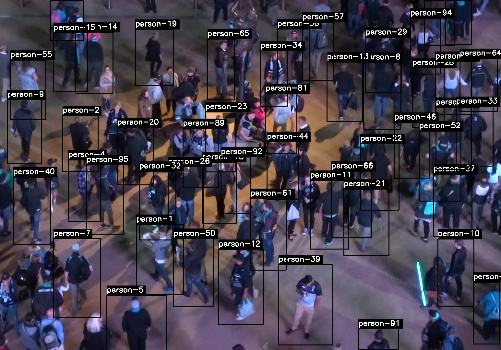

# IW276SS21P15 Person Tracking

The goal of the project is to create a model that is able to detect and track people throughout consecutive frames. 
Detection is visualised through bounding boxes and tracking is shown by unique ids for every person.

<p align="center">
   
</p>

> This work was done by Atanas Atanasov, Nikolay Dimitrov, Stefan Hristov during the IW276 Autonome Systeme Labor at the Karlsruhe University of Applied Sciences (Hochschule Karlruhe - Technik und Wirtschaft) in SS2021.

## Table of Contents

* [Requirements](#requirements)
* [Running](#running)
* [Acknowledgments](#acknowledgments)

## Requirements
* Python 3.6 (or above)
* OpenCV 4.1 (or above)
* Jetson Nano
* Jetpack 4.5
* Tensorflow 2.3 (or above)


## Running

Open the terminal and navigate to the project folder. Then execute the following commands:

```
sh build-docker-image.sh

sudo docker run -it as15_my_img

sh run-tracker.sh
``` 

## Docker

### How to export the images to the host

When the detection and tracking is executed, the images are saved in the docker container. To save the images
from the container to the host directory the following steps should be followed.
The container id should be found and the commands bellow should be executed.

``` 
// Find the container id (container name - my_container_as_15)
sudo docker ps -a 

// Copy the images from the docker container to the host directory
sudo docker cp {CONTAINERID}:/Yolov4_Deepsort-Person-Tracking/outputs /home/{USER}
```

## Acknowledgments

This repo is based on
  - [YOLOv4 Deeosort](https://github.com/theAIGuysCode/yolov4-deepsort)
  - [MOT20 Challenge](https://motchallenge.net/data/MOT20/)
  - [IW276WS20-P10](https://github.com/IW276/IW276WS20-P10)
  - [darknet](https://github.com/AlexeyAB/darknet)


Thanks to the original authors for their work!

## Contact
Please email `mickael.cormier AT iosb.fraunhofer.de` for further questions.
